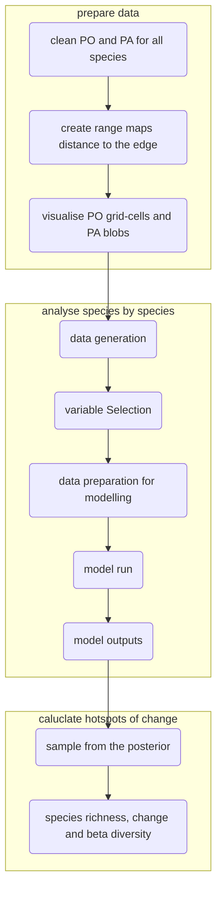

# Hotspots of change - Neotropical carnivores

## A continental-wide decline of occupancy and diversity in five charismatic Neotropical carnivores

*Florencia Grattarola, Kateřina Tschernosterová & Petr Keil*

This repository includes the data, code, model and outputs for our work on mapping the temporal change, the areas where gains and losses accumulated for all species (hotspots of change), and calculating the spatial and temporal dissimilarity. 

### Species

Photo credits **iNaturalist.org**: jaguarundi (*Herpailurus yagouaroundi*) by @hhulsberg, ocelot (*Leopardus pardalis*) by @cotingidae, crab-eating fox (*Cerdocyon thous*) by @farpost, maned wolf (*Chrysocyon brachyurus*) by @constanzamcl, tayra (*Eira barbara*) by @christoph_moning, margay (*Leopardus wiedii*) by @bigsam, coati (*Nasua nasua*) by @douglasmeyer, and giant river otter (*Pteronura brasiliensis*) by @npdowling.  
